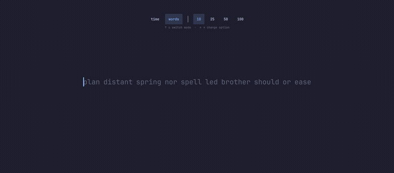

# Omatype

A local, offline MonkeyType-style typing speed test, running as an Omarchy
shell overlay. No network calls — the word list is bundled at
`words/english_1k.json` (see `ATTRIBUTION.md`).



## Requirements

> **This is an Omarchy plugin, not a standalone app.** It runs *inside*
> `omarchy-shell` (the Quattro Quickshell-based shell) as an `overlay`
> plugin — there is no separate binary and nothing to launch on its own.

You need:

- [Omarchy](https://omarchy.org) with `omarchy-shell` running (Linux +
  Hyprland/Wayland)
- The `omarchy plugin` CLI (ships with Omarchy)

It will not run on macOS or Windows, on a plain Hyprland setup without
Omarchy, or under a different desktop/shell.

## Install

```bash
omarchy plugin add https://github.com/ayacoders/omatype.git --enable --yes
```

Then bind a key by adding this to `~/.config/hypr/bindings.lua`:

```lua
o.bind("SUPER + SHIFT + CTRL + T", "Omatype", "omarchy-shell shell toggle aya.omatype")
```

Reload Hyprland (`hyprctl reload`) and press **Super+Shift+Ctrl+T**.

> Plugins run as unsandboxed code inside `omarchy-shell`. Review the source
> before enabling anything — this one is ~1k lines of QML/JS plus a bundled
> word list, and makes no network calls.

To update or remove later:

```bash
omarchy plugin update aya.omatype
omarchy plugin remove aya.omatype
```

## Usage

- Toggle any time with your keybinding, or
  `omarchy-shell shell toggle aya.omatype`.
- Fully keyboard-driven: **↑ ↓** switch between time/words mode, **← →**
  change the duration or word count — or click the chips. Both are locked
  mid-run.
- Start typing to begin. **Space** submits a word. **Backspace** edits the
  current word and steps back into the previous one when you're at its
  start; **Ctrl+Backspace** clears a whole word at once. Overtyping a word
  stops 10 characters past its length.
- **Tab** restarts with fresh words, **Shift+Tab** replays the *same* words
  so you can compare runs over identical text, **Esc** aborts a run (or
  closes the overlay when idle).
- Results show net WPM, raw WPM, accuracy, consistency (how *even* your pace
  was, not how fast), and elapsed time.

## Files

| File | Role |
| --- | --- |
| `TypingTest.qml` | All state and test logic; composes the rest |
| `WordStream.qml` | Line-wrapped, centered word viewport, and the caret |
| `WordItem.qml` | One word: per-character coloring |
| `ConfigBar.qml` | Mode/duration/word-count chips |
| `ResultsScreen.qml` | End-of-run stats |
| `WpmGraph.qml` | WPM-over-time chart on the results screen |
| `TypingTestModel.js` | Pure logic: word picking, line wrapping, scoring, graph math |

## Development

Clone into the plugin directory so the shell picks it up:

```bash
git clone https://github.com/ayacoders/omatype.git \
  ~/.config/omarchy/plugins/aya.omatype
omarchy-shell shell rescanPlugins
omarchy plugin enable aya.omatype
```

Check and drive it:

```bash
omarchy plugin validate ~/.config/omarchy/plugins/aya.omatype
for f in ~/.config/omarchy/plugins/aya.omatype/*.qml; do
  qmllint -I "$OMARCHY_PATH/shell" "$f"
done

# The pure logic (scoring, line wrapping, graph math) has its own tests.
node --test tests/model.test.js

omarchy-shell shell summon aya.omatype '{}'
omarchy-shell shell call aya.omatype setMode words
omarchy-shell shell hide aya.omatype
```

Saving a file hot-reloads it, but an already-open overlay keeps the old code
until it next mounts (`keepLoaded: true`) — run `omarchy-restart-shell` if a
change doesn't seem to land.

## Known limitations

- Results aren't saved between runs.
- Backspace only reaches back as far as the rolling render window keeps —
  about one completed line (see `trimCompletedLine()`).
- One word list: `english_1k`, MonkeyType's 1000 most common English words.

## License

MIT for the plugin code (see `LICENSE`). The bundled word list is
GPL-3.0 from MonkeyType — see `ATTRIBUTION.md`.
